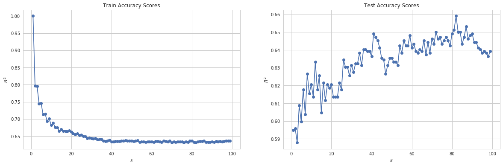

# Models
{: .no_toc }

## Table of contents
{: .no_toc .text-delta }

1. TOC
{:toc}

---

Our goal for this project is to construct a list of songs from a new list of songs that Grace would like to add to her existing playlist. We attempt to do this by training a variety of different models to predict whether or not a song should be included in Grace's playlist. By framing the question in this way, we recognize that playlist construction can be considered from a classification perspective, where we need to classify each song in our test set as either being `in_playlist` or not `in_playlist`.

# Setup

We first split our data into a train and test set, so that we are later able to assess how well our model performs in both a train set and a not-seen test set.

```python
train, test = train_test_split(spotify_df, test_size = 0.2, random_state=50)
x_train, y_train = train.drop(columns=[response_col]), train[response_col].values
x_test, y_test = test.drop(columns=[response_col]), test[response_col].values
```

# Baseline Model

We began our project by first constructing a baseline model - one where we simply predict that all songs should be included in our existing playlist. 
This serves as a good source of comparison for our future models, which should at least do better than this trivial one.

```python
baseline_train_score = np.sum(y_train == 1) / len(train)
baseline_test_score = np.sum(y_test == 1) / len(test)
print('Baseline model (all songs are added to the existing playlist) train score:', baseline_train_score)
print('Baseline model (all songs are added to the existing playlist) test score:', baseline_test_score)
```

    Baseline model (all songs are added to the existing playlist) train score: 0.5034584980237155
    Baseline model (all songs are added to the existing playlist) test score: 0.5158102766798419

We can see that our trivial model does not perform very well in either the train or test set, achieving 50.3% accuracy in the train set and 51.6% accuracy in the test set. 


# Logistic Classifier

Given our objective, we next considered simple, interpretable models that could help us classify our data. 
A clear option was the logistic model, which works well for binary classifications.
We fit a logistic classifier on all 14 features of our training data. 

```python
# set seed
random.seed(1)

# split into train and test
train, test = train_test_split(spotify_df, test_size = 0.2, random_state=50)
x_train, y_train = train.drop(columns=[response_col]), train[response_col].values
x_test, y_test = test.drop(columns=[response_col]), test[response_col].values

# create logistic model
log_reg_model = LogisticRegression(C=100000, fit_intercept=False)
log_reg_model.fit(x_train, y_train)

# predict
log_reg_train_predictions = log_reg_model.predict(x_train)
log_reg_test_predictions = log_reg_model.predict(x_test)

# calculate scores
log_reg_train_score = accuracy_score(y_train, log_reg_train_predictions)
log_reg_test_score = accuracy_score(y_test, log_reg_test_predictions)

# display scores
print('[Logistic Regression] Classification accuracy for train set: {}'.format(log_reg_train_score))
print('[Logistic Regression] Classification accuracy for test set: {}'.format(log_reg_test_score))
```

    [Logistic Regression] Classification accuracy for train set: 0.6936758893280632
    [Logistic Regression] Classification accuracy for test set: 0.6709486166007905


Our baseline logistic model is able to achieve an accuracy of roughly 69.4% in the training set, and 67.1% in the test set. We can see that this is already better than our trivial baseline model, which is a great sign! However, we believe we can build an even better predictive model.


# Logistic Classifier with Quadratic Terms

Our next appraoch was to consider a logistic regression model that includes quadratic terms as well as main effect terms, in an attempt to capture any polynomial relationships that may exist between our features and whether or not a particular song should be included in our playlist.


```python
# add quadratic terms
x_train_q = x_train.copy()
x_test_q = x_test.copy()

# add quadratic terms
for col in x_train:
    if col != "mode": # our only binary variable
        name = col + "^2" # name column as col^2
        x_train_q[name] = np.square(x_train_q[col])
        x_test_q[name] = np.square(x_test_q[col])

# create logistic model
log_reg_model_q = LogisticRegression(C=100000, fit_intercept=False)
log_reg_model_q.fit(x_train_q, y_train)

# predict
log_reg_train_q_predictions = log_reg_model_q.predict(x_train_q)
log_reg_test_q_predictions = log_reg_model_q.predict(x_test_q)

# calculate scores
log_reg_train_q_score = accuracy_score(y_train, log_reg_train_q_predictions)
log_reg_test_q_score = accuracy_score(y_test, log_reg_test_q_predictions)

# display scores
print('[Logistic Regression With Quadratic Terms] Classification accuracy for train set: {}'.format(log_reg_train_q_score))
print('[Logistic Regression With Quadratic Terms] Classification accuracy for test set: {}'.format(log_reg_test_q_score))
```

    [Logistic Regression With Quadratic Terms] Classification accuracy for train set: 0.4965415019762846
    [Logistic Regression With Quadratic Terms] Classification accuracy for test set: 0.4841897233201581


However, after adding quadratic terms to our model, we see that the model performs worse. The test and training accuracies are both quite low at roughly 48.4% and 49.7%.


# L1 and L2 Regularization

Given our low scores on our logistic regression model with quadratic terms, we consider adding regularization to our model to make sure that we are not overfitting to our training data. We consider both L1 and L2 regularization. 


```python
# L1 regularization
lr_l1_model = LogisticRegressionCV(cv=5, penalty='l1', solver='liblinear', max_iter=100000).fit(x_train, y_train)
# L2 regularization
lr_l2_model = LogisticRegressionCV(cv=5, max_iter=100000).fit(x_train, y_train)
```


```python
def get_lr_cv(model, model_name, x_train=x_train, y_train=y_train, x_test=x_test, y_test=y_test):
    train_predictions = model.predict(x_train)
    train_score = accuracy_score(y_train, train_predictions)
    test_predictions = model.predict(x_test)
    test_score = accuracy_score(y_test, test_predictions)
    test_confusion_matrix = confusion_matrix(y_test, test_predictions)
    print('[{}] Classification accuracy for train set: {}'.format(model_name, train_score))
    print('[{}] Classification accuracy for test set: {}'.format(model_name, test_score))
    return train_score, test_score, test_confusion_matrix
l1_stats = get_lr_cv(lr_l1_model, 'L1 Reg')
l2_stats = get_lr_cv(lr_l2_model, 'L2 Reg')
```

    [L1 Reg] Classification accuracy for train set: 0.8866106719367589
    [L1 Reg] Classification accuracy for test set: 0.8873517786561265
    [L2 Reg] Classification accuracy for train set: 0.6926877470355731
    [L2 Reg] Classification accuracy for test set: 0.6699604743083004


We can see that L1 regularization performs much better than L2. The L1 regularized model achieves about 88.8% accuracy in the training data and about 88.9% in the test, well outperforming our baseline model. The L2 regularized model performs on par with our baseline, achieving a training accuracy of around 69.2% and a test accuracy of 66.9%.

# kNN

We next decided to try a different classification approach, specifically, the k-nearest neighbors model.


```python
# make kNN preds binary
def parsenKKRes(predictions):
    for i in range(len(predictions)):
        if predictions[i] < 0.5:
            predictions[i] = 0
        else:
            predictions[i] = 1
    return predictions
```


```python
# make regressor
ks = range(1, 100) # Grid of k's
scores_train = [] # R2 scores
scores_test = [] # R2 scores
acc_train = []
acc_test = []
for k in ks:
    knnreg = KNeighborsRegressor(n_neighbors=k) # Create KNN model
    knnreg.fit(x_train, y_train) # Fit the model to training data
    scores_train.append(knnreg.score(x_train, y_train))  # Calculate R^2 score
    scores_test.append(knnreg.score(x_test, y_test)) # Calculate R^2 score
    predicted_train = knnreg.predict(x_train)
    predicted_test = knnreg.predict(x_test)
    acc_train.append(accuracy_score(y_train, parsenKKRes(predicted_train)))
    acc_test.append(accuracy_score(y_test, parsenKKRes(predicted_test)))

# Plot
fig, ax = plt.subplots(1,2, figsize=(20,6))
ax[0].plot(ks, scores_train,'o-')
ax[0].set_xlabel(r'$k$')
ax[0].set_ylabel(r'$R^{2}$')
ax[0].set_title(r'Train $R^{2}$')
ax[1].plot(ks, scores_test,'o-')
ax[1].set_xlabel(r'$k$')
ax[1].set_ylabel(r'$R^{2}$')
ax[1].set_title(r'Test $R^{2}$')
plt.show()
```





```python
# determine which k index has best test accuracy
k_index = np.argmax(acc_test)
print("[kNN] Classification accuracy for training set: ", acc_train[k_index])
print("[kNN] Classification accuracy for test set: ", acc_test[k_index])
```

    [kNN] Classification accuracy for training set:  0.6314229249011858
    [kNN] Classification accuracy for test set:  0.6590909090909091


Our kNN regressor performs at the same level as our baseline logistic classifier. The test set is at a 65.9% accuracy while the training is at 63.1%.

# LDA and QDA

We now consider discriminant analysis, which provides an alternative approach to classification.
We will try both LDA and QDA and compare them.

```python
# LDA
lda = LinearDiscriminantAnalysis()
model_lda = lda.fit(x_train, y_train)
acc_lda = model_lda.score(x_train, y_train)
acc_lda_test = model_lda.score(x_test, y_test)

# print accuracy scores
print("[LDA] Classification accuracy for train set :",acc_lda)
print("[LDA] Classification accuracy for test set :",acc_lda_test)


# QDA
qda = QuadraticDiscriminantAnalysis()
model_qda = qda.fit(x_train, y_train)
acc_qda = model_qda.score(x_train, y_train)
acc_qda_test = model_qda.score(x_test, y_test)
print("[QDA] Classification accuracy for train set:",acc_qda)
print("[QDA] Classification accuracy for test set:",acc_qda_test)

```

    [LDA] Classification accuracy for train set : 0.8809288537549407
    [LDA] Classification accuracy for test set : 0.8843873517786561
    [QDA] Classification accuracy for train set: 0.8656126482213439
    [QDA] Classification accuracy for test set: 0.866600790513834


LDA performs better than QDA, and both perform above baseline. LDA achieves an accuracy of about 88.1% in the training and 88.4% in the testing data, while QDA ahieves an accuracy of about 86.6% in the training and 86.7% in the testing data.

# Decision Trees
The next type of decision model we are interested in is the decision tree.
We will first create a simple tree.

```python
# classify by depth
def treeClassifierByDepth(depth, x_train, y_train, cvt = 5):
    model = DecisionTreeClassifier(max_depth=depth).fit(x_train, y_train)
    return cross_val_score(model, x_train, y_train, cv = cvt)
```


```python
# 5-fold CV
means = []
lower = []
upper = []
sds = []
trains = []
for i in range(1, 20):
    # fit model
    tc = treeClassifierByDepth(i, x_train, y_train)
    # calc mean and sd
    cur_mean = np.mean(tc)
    cur_sd = np.std(tc)
    train_val = DecisionTreeClassifier(max_depth=i).fit(x_train, y_train).score(x_train,y_train)
    # add to lists
    trains.append(train_val)
    means.append(cur_mean)
    lower.append(cur_mean - 2*cur_sd)
    upper.append(cur_mean + 2*cur_sd)
    
plt.plot(range(1,20),means)
plt.fill_between(range(1,20), lower, upper, alpha = 0.3, label = "Mean CV score (+/- 2SD)")
plt.plot(range(1,20), trains, label="Train")
plt.title("Spotify Playlist Decision Tree Model Estimated Performance")
plt.xlabel("Maximum Depth")
plt.ylabel("Score")
plt.legend()
plt.show()
```


```python
# cross validation performance
train_score = means[5]
print("[Decision Tree Classifier] Mean classification accuracy training set: ",train_score)
print("Mean +/- 2 SD: (", lower[4],",",upper[4],")")
```

    [Decision Tree Classifier] Mean classification accuracy training set:  0.8796923499519297
    Mean +/- 2 SD: ( 0.8649746226416641 , 0.8909557288057866 )


```python
# test set performance
model_dec_tree = DecisionTreeClassifier(max_depth=6).fit(x_train, y_train)
test_score = model_dec_tree.score(x_test, y_test)
print("[Decision Tree Classifier] Mean classification accuracy test set: ", test_score)
```

    [Decision Tree Classifier] Mean classification accuracy test set:  0.8903162055335968


We achieve the best cross-validation score at a tree depth of 6, with an accuracy of 88.0%. Additionally, we observe a relatively narrow spread in estimated performances, as there is a roughly 2% difference between +/- two standard deviations. We see that this model also performs quite well in the test set, with an accuracy score of 88.7%, proving superior to all the other models we have tried so far.

# Random Forest
Now, we will consider ensemble methods that improve upon our simple decision tree.
The first one we try is the random forest, which randomly subsets predictors upon which to generate decision trees.

```python
# config parameters
num_trees = 45
new_depth = 6

# model random forest
model_rf = RandomForestClassifier(n_estimators=num_trees, max_depth=new_depth)

# fit model on X_train data
model_rf.fit(x_train, y_train)

# predict using model
y_pred_train_rf = model_rf.predict(x_train)
y_pred_test_rf = model_rf.predict(x_test)

# accuracy from train and test
train_score_rf = accuracy_score(y_train, y_pred_train_rf)
test_score_rf = accuracy_score(y_test, y_pred_test_rf)

# print accuracy scores
print("[Random Forest] Classification accuracy for train set: ", train_score_rf)
print("[Random Forest] Classification accuracy for test set:", test_score_rf)
```

    [Random Forest] Classification accuracy for train set:  0.9300889328063241
    [Random Forest] Classification accuracy for test set: 0.9229249011857708


A random forest, at the same depth as the decision tree (namely a depth of 6) performs even better. The test data reaches an accuracy of about 92.6% in the training at 91.5% in the test. 

# Bagging
Our next ensemble method is bagging. 
We create 45 bootstrapped datasets, fitting a decision tree to each of them and saving their predictions:


```python
# bootstrap
bagging_train_arr = []
bagging_test_arr = []
estimators = []

tree_res = []

tree = DecisionTreeClassifier(max_depth=new_depth)

# classify train and test with bootstrap models
for i in range(num_trees):
    boot_x, boot_y = resample(x_train, y_train)
    fit_tree = tree.fit(boot_x, boot_y)
    estimators.append(fit_tree)
    bagging_train_arr.append(tree.predict(x_train))
    bagging_test_arr.append(tree.predict(x_test))
```

Construct dataframes with all the bootstrapped data:


```python
# train
bagging_train = pd.DataFrame()
for i in range(len(bagging_train_arr)):
    col_name = "Bootstrap Model " + str(i + 1)
    bagging_train[col_name] = bagging_train_arr[i]

# test
bagging_test = pd.DataFrame()
for i in range(len(bagging_test_arr)):
    col_name = "Bootstrap Model " + str(i + 1)
    bagging_test[col_name] = bagging_test_arr[i]
    
# generate renaming row obj
rename = {}

for i in range(0, 1104):
    rename[i] = "Training Row " + str(i + 1)


bagging_train.rename(rename, inplace=True)
bagging_test.rename(rename,  inplace=True)
```

Combine predictions from all the bootstraps and assess how the model performs:


```python
# combining all data points from the data to determine accuracy
y_preds_train = []
y_preds_test = []

for row in bagging_train.iterrows():
    if np.mean(row[1]) > 0.5:
        y_preds_train.append(1)
    else:
        y_preds_train.append(0)

for row in bagging_test.iterrows():
    if np.mean(row[1]) > 0.5:
        y_preds_test.append(1)
    else:
        y_preds_test.append(0)
        
def compare_acc(preds, actual):
    count = 0
    for i in range(len(preds)):
        if preds[i] == actual.item(i):
            count += 1
    return(count/len(preds))

bagging_train_score = compare_acc(y_preds_train,y_train)
bagging_test_score = compare_acc(y_preds_test,y_test)

print("[Bagging] Classification accuracy for train set: ", bagging_train_score)
print("[Bagging] Classification accuracy for test set: ", bagging_test_score)
```

    [Bagging] Classification accuracy for train set:  0.9370059288537549
    [Bagging] Classification accuracy for test set:  0.9150197628458498


The model clearly performed better after using bootstrapped data to fit it. It has increased from 88% on the training data to 94.0%, and from 88.1% on the test data to 90.4%. This makes bagging the most accurate model we have tried so far.

# Boosting
Finally, we will consider boosting, an iterative approach that might eliminate some more of the error in our trees.

```python
# define classifier function
def boostingClassifier(x_train, y_train, depth):
    # AdaBoostClassifier
    abc = AdaBoostClassifier(DecisionTreeClassifier(max_depth=depth),
                         n_estimators=800, learning_rate = 0.05)
    abc.fit(x_train, y_train)
    # staged_score train to plot
    abc_predicts_train = list(abc.staged_score(x_train,y_train))
    plt.plot(abc_predicts_train, label = "train");

    # staged_score test to plot
    abc_predicts_test = list(abc.staged_score(x_test,y_test))
    plt.plot(abc_predicts_test, label = "test");

    plt.legend()
    plt.title("AdaBoost Classifier Accuracy, n = "+str(depth))
    plt.xlabel("Iterations")
    plt.show()
    
    return("Maximum test accuracy for depth of "+str(depth)+" is "+str(max(abc_predicts_test))+" at "+str(abc_predicts_test.index(max(abc_predicts_test)))+" iterations")
```


```python
for i in range(1,5):
    print(boostingClassifier(x_train, y_train, i))
```


    Maximum test accuracy for depth of 1 is 0.9150197628458498 at 773 iterations


    Maximum test accuracy for depth of 2 is 0.9298418972332015 at 751 iterations


    Maximum test accuracy for depth of 3 is 0.9268774703557312 at 500 iterations


    Maximum test accuracy for depth of 4 is 0.9219367588932806 at 530 iterations


We see based upon an AdaBoostClassifier the maximum test accuracy of 93.0% is attained at a depth of 2. This is attained after 751 iterations. The AdaBoostClassifier is our most accurate model so far.

# Neural Networks

Finally, we created an artificial neural network to classify our playlist songs.


```python
# check input and output dimensions
input_dim_2 = x_train.shape[1]
output_dim_2 = 1
print(input_dim_2,output_dim_2)
```

    14 1


```python
# create sequential multi-layer perceptron
model2 = Sequential() 

# initial layer
model2.add(Dense(10, input_dim=input_dim_2,  
                activation='relu')) 

# second layer
model2.add(Dense(10, input_dim=input_dim_2,  
                activation='relu'))

# third layer
model2.add(Dense(10, input_dim=input_dim_2,  
                activation='relu'))

# output layer
model2.add(Dense(1, activation='sigmoid'))

# compile the model
model2.compile(loss='binary_crossentropy', optimizer='sgd', metrics=['accuracy'])
model2.summary()
```

```python
# fit the model
model2_history = model2.fit(
    x_train, y_train,
    epochs=50, validation_split = 0.5, batch_size = 128, verbose=False)
```


```python
# model loss
print("[Neural Net - Model 1] Loss: ", model2_history.history['loss'][-1])
print("[Neural Net - Model 1] Val Loss: ", model2_history.history['val_loss'][-1])
print("[Neural Net - Model 1] Test Loss: ", model2.evaluate(x_test, y_test, verbose=False))
print("[Neural Net - Model 1] Accuracy: ", model2_history.history['acc'][-1])
print("[Neural Net - Model 1] Val Accuracy: ", model2_history.history['val_acc'][-1])
```

    [Neural Net - Model 1] Loss:  7.79790558079957
    [Neural Net - Model 1] Val Loss:  8.034205742033103
    [Neural Net - Model 1] Test Loss:  [7.719139232937055, 0.5158102769154334]
    [Neural Net - Model 1] Accuracy:  0.5108695654529828
    [Neural Net - Model 1] Val Accuracy:  0.49604743024106085


Our initial accuracy isn't great. We achieve an accuracy of 48.9% in the training and 50.4% in the validation, and an accuracy of 48.4% in the test. Let's see if we can improve our network to fit the data better.


```python
# create sequential multi-layer perceptron
model3 = Sequential() 

# Hidden layers
for i in range(40):
    model3.add(Dense(10, input_dim=input_dim_2, 
        activation='relu')) 

# output layer
model3.add(Dense(output_dim_2, activation='sigmoid'))


# compile the model
model3.compile(loss='binary_crossentropy', optimizer='adam', metrics=['acc'])
model3.summary()
```

```python
# fit the model
model3_history = model3.fit(
    x_train, y_train,
    epochs=300, validation_split = 0.1, batch_size = 128, verbose=False)
```


```python
# model loss
print("[Neural Net - Model 2] Loss: ", model3_history.history['loss'][-1])
print("[Neural Net - Model 2] Val Loss: ", model3_history.history['val_loss'][-1])
print("[Neural Net - Model 2] Test Loss: ", model3.evaluate(x_test, y_test, verbose=False))
print("[Neural Net - Model 2] Accuracy: ", model3_history.history['acc'][-1])
print("[Neural Net - Model 2] Val Accuracy: ", model3_history.history['val_acc'][-1])
```

    [Neural Net - Model 2] Loss:  0.6267417644590524
    [Neural Net - Model 2] Val Loss:  0.6291195959220698
    [Neural Net - Model 2] Test Loss:  [0.6115785545040026, 0.6432806319398843]
    [Neural Net - Model 2] Accuracy:  0.625857809154077
    [Neural Net - Model 2] Val Accuracy:  0.6197530875971288


Even after changing hyperparameters, our neural network does not perform very well. Using 40 layers and 300 epochs, the accuracy in the training data is still 62.8% while the accuracy in the test is 65.2%. This is baffling, because we expected our neural network to perform very well. Perhaps this mediocre perforance is due to limitations of our data set (only 14 features and <5000 songs), or of the specific methods we used.

---

# Model Selection

Based upon the presented analysis, we conclude that our boosted decision tree classifier, at a depth of 2 with 751 iterations, is the best model. It achieves the highest accuracy in the test set, of 93.0%.


